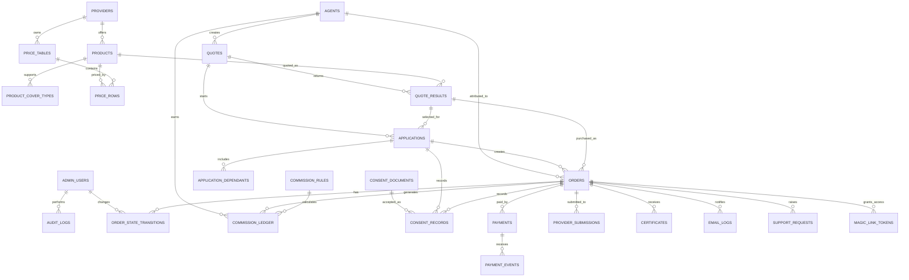

# Database Schema and ER Diagram: OSHC Comparison Platform

## 1. Document Control

| Field | Value |
| --- | --- |
| Product | OSHC comparison, purchase, and certificate delivery platform |
| Source documents | `docs/BRD_OSHC_Comparison_Platform.md`, `docs/PRD_OSHC_Comparison_Platform.md`, `docs/DEVELOPER_TASK_BACKLOG_OSHC_Platform.md` |
| Prepared on | 2026-06-01 |
| Document type | Database schema and ER diagram |
| Status | Draft |

## 2. Schema Assumptions

- Target database is PostgreSQL or a relational database with equivalent support for UUIDs, timestamps, unique constraints, indexes, and JSON fields.
- Primary keys use UUIDs.
- Timestamps are stored in UTC.
- Money values are stored as integer minor units, for example cents, to avoid floating point errors.
- Sensitive personal data should be encrypted at rest where supported by the selected platform.
- Payment card data is never stored. Only payment processor references and event IDs are stored.
- Certificate files and imported price files are stored in private object storage. Database tables store file references, not file bytes.
- MVP uses imported price tables. Provider APIs can be added later through `provider_submissions` and integration metadata.

## 3. Core Enums

Use enums where the selected stack supports them. Otherwise use constrained strings.

```sql
CREATE TYPE user_role AS ENUM (
  'operations',
  'finance',
  'admin',
  'super_admin'
);

CREATE TYPE agent_status AS ENUM (
  'pending',
  'approved',
  'suspended'
);

CREATE TYPE provider_status AS ENUM (
  'active',
  'inactive'
);

CREATE TYPE product_status AS ENUM (
  'active',
  'inactive'
);

CREATE TYPE cover_type AS ENUM (
  'single',
  'couple',
  'single_parent_family',
  'family'
);

CREATE TYPE sales_channel AS ENUM (
  'direct',
  'agent'
);

CREATE TYPE price_table_status AS ENUM (
  'draft',
  'validated',
  'published',
  'rejected',
  'archived'
);

CREATE TYPE application_status AS ENUM (
  'draft',
  'valid',
  'invalid',
  'submitted'
);

CREATE TYPE order_status AS ENUM (
  'quote_created',
  'application_started',
  'application_completed',
  'payment_pending',
  'payment_failed',
  'paid',
  'provider_submission_pending',
  'provider_submission_failed',
  'certificate_pending',
  'certificate_issued',
  'fulfilled',
  'refund_requested',
  'refunded',
  'cancelled'
);

CREATE TYPE payment_status AS ENUM (
  'created',
  'pending',
  'succeeded',
  'failed',
  'cancelled',
  'refunded',
  'partially_refunded'
);

CREATE TYPE provider_submission_status AS ENUM (
  'not_required',
  'pending',
  'submitted',
  'failed',
  'completed'
);

CREATE TYPE certificate_status AS ENUM (
  'pending',
  'issued',
  'sent',
  'send_failed',
  'revoked'
);

CREATE TYPE email_status AS ENUM (
  'queued',
  'sent',
  'failed',
  'delivered',
  'bounced'
);

CREATE TYPE support_request_type AS ENUM (
  'date_correction',
  'refund',
  'cancellation',
  'certificate_resend',
  'general'
);

CREATE TYPE support_request_status AS ENUM (
  'open',
  'in_progress',
  'waiting_on_customer',
  'resolved',
  'closed'
);
```

## 4. Entity Relationship Diagram



## 5. Table Definitions

### 5.1 Admin Users

```sql
CREATE TABLE admin_users (
  id UUID PRIMARY KEY,
  email TEXT NOT NULL UNIQUE,
  full_name TEXT NOT NULL,
  role user_role NOT NULL,
  password_hash TEXT,
  status TEXT NOT NULL DEFAULT 'active',
  last_login_at TIMESTAMPTZ,
  created_at TIMESTAMPTZ NOT NULL DEFAULT now(),
  updated_at TIMESTAMPTZ NOT NULL DEFAULT now()
);
```

Notes:

- If using an external auth provider, replace `password_hash` with provider subject ID.
- Admin role determines operational, finance, admin, or super admin permissions.

### 5.2 Agents

```sql
CREATE TABLE agents (
  id UUID PRIMARY KEY,
  agency_name TEXT,
  full_name TEXT NOT NULL,
  email TEXT NOT NULL UNIQUE,
  phone TEXT,
  status agent_status NOT NULL DEFAULT 'pending',
  commission_profile_code TEXT,
  approved_at TIMESTAMPTZ,
  suspended_at TIMESTAMPTZ,
  created_at TIMESTAMPTZ NOT NULL DEFAULT now(),
  updated_at TIMESTAMPTZ NOT NULL DEFAULT now()
);

CREATE INDEX idx_agents_status ON agents(status);
```

### 5.3 Providers

```sql
CREATE TABLE providers (
  id UUID PRIMARY KEY,
  code TEXT NOT NULL UNIQUE,
  name TEXT NOT NULL,
  logo_file_ref TEXT,
  status provider_status NOT NULL DEFAULT 'inactive',
  website_url TEXT,
  disclosure_url TEXT,
  product_disclosure_url TEXT,
  support_metadata JSONB NOT NULL DEFAULT '{}'::jsonb,
  created_at TIMESTAMPTZ NOT NULL DEFAULT now(),
  updated_at TIMESTAMPTZ NOT NULL DEFAULT now()
);

CREATE INDEX idx_providers_status ON providers(status);
```

### 5.4 Products

```sql
CREATE TABLE products (
  id UUID PRIMARY KEY,
  provider_id UUID NOT NULL REFERENCES providers(id),
  code TEXT NOT NULL,
  name TEXT NOT NULL,
  status product_status NOT NULL DEFAULT 'inactive',
  fulfilment_mode TEXT NOT NULL DEFAULT 'manual',
  disclosure_url TEXT,
  policy_document_url TEXT,
  key_inclusions JSONB NOT NULL DEFAULT '[]'::jsonb,
  metadata JSONB NOT NULL DEFAULT '{}'::jsonb,
  created_at TIMESTAMPTZ NOT NULL DEFAULT now(),
  updated_at TIMESTAMPTZ NOT NULL DEFAULT now(),
  UNIQUE(provider_id, code)
);

CREATE INDEX idx_products_provider_id ON products(provider_id);
CREATE INDEX idx_products_status ON products(status);
```

### 5.5 Product Cover Types

```sql
CREATE TABLE product_cover_types (
  id UUID PRIMARY KEY,
  product_id UUID NOT NULL REFERENCES products(id) ON DELETE CASCADE,
  cover_type cover_type NOT NULL,
  created_at TIMESTAMPTZ NOT NULL DEFAULT now(),
  UNIQUE(product_id, cover_type)
);

CREATE INDEX idx_product_cover_types_cover_type ON product_cover_types(cover_type);
```

### 5.6 Price Tables

```sql
CREATE TABLE price_tables (
  id UUID PRIMARY KEY,
  provider_id UUID NOT NULL REFERENCES providers(id),
  version INTEGER NOT NULL,
  status price_table_status NOT NULL DEFAULT 'draft',
  effective_from DATE NOT NULL,
  effective_to DATE,
  source_file_ref TEXT,
  imported_by_admin_user_id UUID REFERENCES admin_users(id),
  validation_summary JSONB NOT NULL DEFAULT '{}'::jsonb,
  published_at TIMESTAMPTZ,
  created_at TIMESTAMPTZ NOT NULL DEFAULT now(),
  updated_at TIMESTAMPTZ NOT NULL DEFAULT now(),
  CHECK (effective_to IS NULL OR effective_to >= effective_from),
  UNIQUE(provider_id, version)
);

CREATE INDEX idx_price_tables_provider_status ON price_tables(provider_id, status);
CREATE INDEX idx_price_tables_effective_dates ON price_tables(effective_from, effective_to);
```

### 5.7 Price Rows

```sql
CREATE TABLE price_rows (
  id UUID PRIMARY KEY,
  price_table_id UUID NOT NULL REFERENCES price_tables(id) ON DELETE CASCADE,
  product_id UUID NOT NULL REFERENCES products(id),
  cover_type cover_type NOT NULL,
  duration_days_min INTEGER NOT NULL,
  duration_days_max INTEGER NOT NULL,
  premium_minor_units INTEGER NOT NULL,
  fee_minor_units INTEGER NOT NULL DEFAULT 0,
  currency CHAR(3) NOT NULL DEFAULT 'AUD',
  channel sales_channel,
  metadata JSONB NOT NULL DEFAULT '{}'::jsonb,
  created_at TIMESTAMPTZ NOT NULL DEFAULT now(),
  CHECK (duration_days_min > 0),
  CHECK (duration_days_max >= duration_days_min),
  CHECK (premium_minor_units >= 0),
  CHECK (fee_minor_units >= 0)
);

CREATE INDEX idx_price_rows_lookup
  ON price_rows(product_id, cover_type, duration_days_min, duration_days_max, channel);

CREATE INDEX idx_price_rows_price_table_id ON price_rows(price_table_id);
```

Conflict rule:

- For published price tables, prevent overlapping active rows for the same provider, product, cover type, duration band, channel, and effective period at application level or with database exclusion constraints if available.

### 5.8 Quotes

```sql
CREATE TABLE quotes (
  id UUID PRIMARY KEY,
  session_id TEXT NOT NULL,
  agent_id UUID REFERENCES agents(id),
  channel sales_channel NOT NULL DEFAULT 'direct',
  adults INTEGER NOT NULL,
  children INTEGER NOT NULL,
  policy_start_date DATE NOT NULL,
  policy_end_date DATE NOT NULL,
  calculated_duration_days INTEGER NOT NULL,
  cover_type cover_type NOT NULL,
  expires_at TIMESTAMPTZ NOT NULL,
  created_at TIMESTAMPTZ NOT NULL DEFAULT now(),
  updated_at TIMESTAMPTZ NOT NULL DEFAULT now(),
  CHECK (adults IN (1, 2)),
  CHECK (children BETWEEN 0 AND 10),
  CHECK (policy_end_date > policy_start_date),
  CHECK (calculated_duration_days > 0)
);

CREATE INDEX idx_quotes_session_id ON quotes(session_id);
CREATE INDEX idx_quotes_agent_id ON quotes(agent_id);
CREATE INDEX idx_quotes_created_at ON quotes(created_at);
```

Cover type rules:

| Adults | Children | Cover type |
| --- | ---: | --- |
| 1 | 0 | `single` |
| 2 | 0 | `couple` |
| 1 | 1 or more | `single_parent_family` |
| 2 | 1 or more | `family` |

### 5.9 Quote Results

```sql
CREATE TABLE quote_results (
  id UUID PRIMARY KEY,
  quote_id UUID NOT NULL REFERENCES quotes(id) ON DELETE CASCADE,
  product_id UUID NOT NULL REFERENCES products(id),
  provider_snapshot JSONB NOT NULL,
  product_snapshot JSONB NOT NULL,
  cover_type cover_type NOT NULL,
  premium_minor_units INTEGER NOT NULL,
  fee_minor_units INTEGER NOT NULL DEFAULT 0,
  total_minor_units INTEGER NOT NULL,
  currency CHAR(3) NOT NULL DEFAULT 'AUD',
  disclosure_snapshot JSONB NOT NULL DEFAULT '{}'::jsonb,
  expires_at TIMESTAMPTZ NOT NULL,
  created_at TIMESTAMPTZ NOT NULL DEFAULT now(),
  CHECK (premium_minor_units >= 0),
  CHECK (fee_minor_units >= 0),
  CHECK (total_minor_units = premium_minor_units + fee_minor_units)
);

CREATE INDEX idx_quote_results_quote_id ON quote_results(quote_id);
CREATE INDEX idx_quote_results_product_id ON quote_results(product_id);
```

Purpose:

- Preserve the exact result shown to the customer even if provider prices change later.

### 5.10 Applications

```sql
CREATE TABLE applications (
  id UUID PRIMARY KEY,
  quote_id UUID NOT NULL REFERENCES quotes(id),
  selected_quote_result_id UUID NOT NULL REFERENCES quote_results(id),
  status application_status NOT NULL DEFAULT 'draft',
  applicant_first_name TEXT,
  applicant_family_name TEXT,
  applicant_date_of_birth DATE,
  applicant_gender TEXT,
  applicant_nationality TEXT,
  email TEXT,
  phone TEXT,
  address_line_1 TEXT,
  address_line_2 TEXT,
  city TEXT,
  state_region TEXT,
  postal_code TEXT,
  country TEXT,
  visa_type TEXT,
  course_name TEXT,
  institution_name TEXT,
  student_id TEXT,
  course_start_date DATE,
  course_end_date DATE,
  validation_errors JSONB NOT NULL DEFAULT '[]'::jsonb,
  created_at TIMESTAMPTZ NOT NULL DEFAULT now(),
  updated_at TIMESTAMPTZ NOT NULL DEFAULT now()
);

CREATE INDEX idx_applications_quote_id ON applications(quote_id);
CREATE INDEX idx_applications_email ON applications(email);
CREATE INDEX idx_applications_selected_quote_result_id ON applications(selected_quote_result_id);
```

Sensitive fields:

- Name, date of birth, contact details, nationality, visa/study fields, and dependant details.

### 5.11 Application Dependants

```sql
CREATE TABLE application_dependants (
  id UUID PRIMARY KEY,
  application_id UUID NOT NULL REFERENCES applications(id) ON DELETE CASCADE,
  dependant_type TEXT NOT NULL,
  first_name TEXT NOT NULL,
  family_name TEXT NOT NULL,
  date_of_birth DATE NOT NULL,
  gender TEXT,
  nationality TEXT,
  relationship_to_applicant TEXT,
  created_at TIMESTAMPTZ NOT NULL DEFAULT now(),
  updated_at TIMESTAMPTZ NOT NULL DEFAULT now()
);

CREATE INDEX idx_application_dependants_application_id
  ON application_dependants(application_id);
```

### 5.12 Consent Documents

```sql
CREATE TABLE consent_documents (
  id UUID PRIMARY KEY,
  document_type TEXT NOT NULL,
  version TEXT NOT NULL,
  title TEXT NOT NULL,
  url TEXT NOT NULL,
  is_active BOOLEAN NOT NULL DEFAULT false,
  created_at TIMESTAMPTZ NOT NULL DEFAULT now(),
  UNIQUE(document_type, version)
);

CREATE INDEX idx_consent_documents_active ON consent_documents(document_type, is_active);
```

### 5.13 Consent Records

```sql
CREATE TABLE consent_records (
  id UUID PRIMARY KEY,
  application_id UUID REFERENCES applications(id),
  order_id UUID,
  consent_document_id UUID NOT NULL REFERENCES consent_documents(id),
  accepted_by_email TEXT,
  accepted_at TIMESTAMPTZ NOT NULL DEFAULT now(),
  ip_address INET,
  user_agent TEXT,
  metadata JSONB NOT NULL DEFAULT '{}'::jsonb
);

CREATE INDEX idx_consent_records_application_id ON consent_records(application_id);
CREATE INDEX idx_consent_records_order_id ON consent_records(order_id);
```

Immutability rule:

- Consent records should not be updated after creation. Corrections should create a new record.

### 5.14 Orders

```sql
CREATE TABLE orders (
  id UUID PRIMARY KEY,
  order_reference TEXT NOT NULL UNIQUE,
  application_id UUID NOT NULL REFERENCES applications(id),
  quote_result_id UUID NOT NULL REFERENCES quote_results(id),
  agent_id UUID REFERENCES agents(id),
  channel sales_channel NOT NULL DEFAULT 'direct',
  status order_status NOT NULL,
  total_minor_units INTEGER NOT NULL,
  currency CHAR(3) NOT NULL DEFAULT 'AUD',
  customer_email TEXT NOT NULL,
  customer_full_name TEXT,
  paid_at TIMESTAMPTZ,
  fulfilled_at TIMESTAMPTZ,
  cancelled_at TIMESTAMPTZ,
  refunded_at TIMESTAMPTZ,
  created_at TIMESTAMPTZ NOT NULL DEFAULT now(),
  updated_at TIMESTAMPTZ NOT NULL DEFAULT now(),
  CHECK (total_minor_units >= 0)
);

CREATE INDEX idx_orders_application_id ON orders(application_id);
CREATE INDEX idx_orders_agent_id ON orders(agent_id);
CREATE INDEX idx_orders_status ON orders(status);
CREATE INDEX idx_orders_customer_email ON orders(customer_email);
CREATE INDEX idx_orders_created_at ON orders(created_at);
```

### 5.15 Order State Transitions

```sql
CREATE TABLE order_state_transitions (
  id UUID PRIMARY KEY,
  order_id UUID NOT NULL REFERENCES orders(id) ON DELETE CASCADE,
  from_status order_status,
  to_status order_status NOT NULL,
  actor_admin_user_id UUID REFERENCES admin_users(id),
  actor_type TEXT NOT NULL DEFAULT 'system',
  reason TEXT,
  metadata JSONB NOT NULL DEFAULT '{}'::jsonb,
  created_at TIMESTAMPTZ NOT NULL DEFAULT now()
);

CREATE INDEX idx_order_state_transitions_order_id
  ON order_state_transitions(order_id, created_at);
```

Valid MVP transition map:

| From | To |
| --- | --- |
| `quote_created` | `application_started` |
| `application_started` | `application_completed` |
| `application_completed` | `payment_pending` |
| `payment_pending` | `payment_failed` |
| `payment_failed` | `payment_pending` |
| `payment_pending` | `paid` |
| `paid` | `provider_submission_pending` |
| `provider_submission_pending` | `provider_submission_failed` |
| `provider_submission_failed` | `provider_submission_pending` |
| `paid` | `certificate_pending` |
| `provider_submission_pending` | `certificate_pending` |
| `certificate_pending` | `certificate_issued` |
| `certificate_issued` | `fulfilled` |
| `paid` | `refund_requested` |
| `fulfilled` | `refund_requested` |
| `refund_requested` | `refunded` |
| Any non-terminal state | `cancelled` |

Terminal states:

- `fulfilled`
- `refunded`
- `cancelled`

### 5.16 Payments

```sql
CREATE TABLE payments (
  id UUID PRIMARY KEY,
  order_id UUID NOT NULL REFERENCES orders(id),
  processor TEXT NOT NULL,
  processor_payment_reference TEXT,
  status payment_status NOT NULL DEFAULT 'created',
  amount_minor_units INTEGER NOT NULL,
  currency CHAR(3) NOT NULL DEFAULT 'AUD',
  failure_code TEXT,
  failure_message TEXT,
  created_at TIMESTAMPTZ NOT NULL DEFAULT now(),
  updated_at TIMESTAMPTZ NOT NULL DEFAULT now(),
  succeeded_at TIMESTAMPTZ,
  failed_at TIMESTAMPTZ,
  CHECK (amount_minor_units >= 0)
);

CREATE INDEX idx_payments_order_id ON payments(order_id);
CREATE INDEX idx_payments_processor_reference ON payments(processor, processor_payment_reference);
```

### 5.17 Payment Events

```sql
CREATE TABLE payment_events (
  id UUID PRIMARY KEY,
  payment_id UUID REFERENCES payments(id),
  processor TEXT NOT NULL,
  processor_event_id TEXT NOT NULL,
  event_type TEXT NOT NULL,
  payload JSONB NOT NULL,
  processed_at TIMESTAMPTZ,
  processing_error TEXT,
  created_at TIMESTAMPTZ NOT NULL DEFAULT now(),
  UNIQUE(processor, processor_event_id)
);

CREATE INDEX idx_payment_events_payment_id ON payment_events(payment_id);
CREATE INDEX idx_payment_events_event_type ON payment_events(event_type);
```

Payment handling rules:

- Webhook signature must be verified before inserting `payment_events`.
- Duplicate `processor_event_id` values must not trigger duplicate state transitions.
- `payment_succeeded` transitions the order to `paid` exactly once.
- `payment_failed` keeps the order recoverable.

### 5.18 Provider Submissions

```sql
CREATE TABLE provider_submissions (
  id UUID PRIMARY KEY,
  order_id UUID NOT NULL REFERENCES orders(id),
  provider_id UUID NOT NULL REFERENCES providers(id),
  status provider_submission_status NOT NULL DEFAULT 'pending',
  submission_mode TEXT NOT NULL DEFAULT 'manual',
  external_reference TEXT,
  request_payload JSONB,
  response_payload JSONB,
  error_code TEXT,
  error_message TEXT,
  submitted_at TIMESTAMPTZ,
  completed_at TIMESTAMPTZ,
  created_at TIMESTAMPTZ NOT NULL DEFAULT now(),
  updated_at TIMESTAMPTZ NOT NULL DEFAULT now()
);

CREATE INDEX idx_provider_submissions_order_id ON provider_submissions(order_id);
CREATE INDEX idx_provider_submissions_status ON provider_submissions(status);
```

### 5.19 Certificates

```sql
CREATE TABLE certificates (
  id UUID PRIMARY KEY,
  order_id UUID NOT NULL REFERENCES orders(id),
  provider_id UUID NOT NULL REFERENCES providers(id),
  policy_number TEXT,
  status certificate_status NOT NULL DEFAULT 'pending',
  file_ref TEXT,
  file_name TEXT,
  file_size_bytes INTEGER,
  issued_at TIMESTAMPTZ,
  sent_at TIMESTAMPTZ,
  uploaded_by_admin_user_id UUID REFERENCES admin_users(id),
  metadata JSONB NOT NULL DEFAULT '{}'::jsonb,
  created_at TIMESTAMPTZ NOT NULL DEFAULT now(),
  updated_at TIMESTAMPTZ NOT NULL DEFAULT now(),
  CHECK (file_size_bytes IS NULL OR file_size_bytes >= 0)
);

CREATE INDEX idx_certificates_order_id ON certificates(order_id);
CREATE INDEX idx_certificates_provider_policy ON certificates(provider_id, policy_number);
CREATE INDEX idx_certificates_status ON certificates(status);
```

Certificate fulfilment states:

| State | Meaning |
| --- | --- |
| `pending` | Paid order is awaiting certificate issue or upload |
| `issued` | Certificate exists and is ready to send |
| `sent` | Certificate email was sent successfully |
| `send_failed` | Certificate email failed and needs operations attention |
| `revoked` | Certificate was invalidated or replaced |

### 5.20 Email Logs

```sql
CREATE TABLE email_logs (
  id UUID PRIMARY KEY,
  order_id UUID REFERENCES orders(id),
  recipient_email TEXT NOT NULL,
  template_key TEXT NOT NULL,
  status email_status NOT NULL DEFAULT 'queued',
  provider TEXT,
  provider_message_id TEXT,
  subject TEXT,
  error_message TEXT,
  metadata JSONB NOT NULL DEFAULT '{}'::jsonb,
  created_at TIMESTAMPTZ NOT NULL DEFAULT now(),
  sent_at TIMESTAMPTZ,
  updated_at TIMESTAMPTZ NOT NULL DEFAULT now()
);

CREATE INDEX idx_email_logs_order_id ON email_logs(order_id);
CREATE INDEX idx_email_logs_status ON email_logs(status);
CREATE INDEX idx_email_logs_recipient_email ON email_logs(recipient_email);
```

### 5.21 Audit Logs

```sql
CREATE TABLE audit_logs (
  id UUID PRIMARY KEY,
  actor_admin_user_id UUID REFERENCES admin_users(id),
  actor_agent_id UUID REFERENCES agents(id),
  actor_type TEXT NOT NULL,
  action TEXT NOT NULL,
  entity_type TEXT NOT NULL,
  entity_id UUID,
  before_data JSONB,
  after_data JSONB,
  metadata JSONB NOT NULL DEFAULT '{}'::jsonb,
  created_at TIMESTAMPTZ NOT NULL DEFAULT now()
);

CREATE INDEX idx_audit_logs_actor_admin ON audit_logs(actor_admin_user_id);
CREATE INDEX idx_audit_logs_actor_agent ON audit_logs(actor_agent_id);
CREATE INDEX idx_audit_logs_entity ON audit_logs(entity_type, entity_id);
CREATE INDEX idx_audit_logs_created_at ON audit_logs(created_at);
```

Audit coverage:

- Provider changes.
- Product changes.
- Price import publish.
- Order state changes.
- Certificate upload.
- Agent approval/suspension.
- Role and permission changes.
- Authentication events.

### 5.22 Magic Link Tokens

Post-MVP, for customer order lookup.

```sql
CREATE TABLE magic_link_tokens (
  id UUID PRIMARY KEY,
  order_id UUID NOT NULL REFERENCES orders(id),
  email TEXT NOT NULL,
  token_hash TEXT NOT NULL UNIQUE,
  purpose TEXT NOT NULL,
  expires_at TIMESTAMPTZ NOT NULL,
  used_at TIMESTAMPTZ,
  created_at TIMESTAMPTZ NOT NULL DEFAULT now()
);

CREATE INDEX idx_magic_link_tokens_order_id ON magic_link_tokens(order_id);
CREATE INDEX idx_magic_link_tokens_email ON magic_link_tokens(email);
CREATE INDEX idx_magic_link_tokens_expires_at ON magic_link_tokens(expires_at);
```

### 5.23 Support Requests

Post-MVP or MVP operations extension.

```sql
CREATE TABLE support_requests (
  id UUID PRIMARY KEY,
  order_id UUID REFERENCES orders(id),
  request_type support_request_type NOT NULL,
  status support_request_status NOT NULL DEFAULT 'open',
  customer_email TEXT NOT NULL,
  subject TEXT,
  description TEXT,
  assigned_admin_user_id UUID REFERENCES admin_users(id),
  metadata JSONB NOT NULL DEFAULT '{}'::jsonb,
  created_at TIMESTAMPTZ NOT NULL DEFAULT now(),
  updated_at TIMESTAMPTZ NOT NULL DEFAULT now(),
  resolved_at TIMESTAMPTZ
);

CREATE INDEX idx_support_requests_order_id ON support_requests(order_id);
CREATE INDEX idx_support_requests_status ON support_requests(status);
CREATE INDEX idx_support_requests_type ON support_requests(request_type);
```

### 5.24 Commission Rules

Post-MVP.

```sql
CREATE TABLE commission_rules (
  id UUID PRIMARY KEY,
  rule_code TEXT NOT NULL UNIQUE,
  provider_id UUID REFERENCES providers(id),
  product_id UUID REFERENCES products(id),
  agent_id UUID REFERENCES agents(id),
  commission_type TEXT NOT NULL,
  commission_value NUMERIC(12, 4) NOT NULL,
  effective_from DATE NOT NULL,
  effective_to DATE,
  status TEXT NOT NULL DEFAULT 'active',
  created_at TIMESTAMPTZ NOT NULL DEFAULT now(),
  updated_at TIMESTAMPTZ NOT NULL DEFAULT now(),
  CHECK (effective_to IS NULL OR effective_to >= effective_from)
);

CREATE INDEX idx_commission_rules_lookup
  ON commission_rules(provider_id, product_id, agent_id, effective_from, effective_to);
```

### 5.25 Commission Ledger

Post-MVP.

```sql
CREATE TABLE commission_ledger (
  id UUID PRIMARY KEY,
  order_id UUID NOT NULL REFERENCES orders(id),
  agent_id UUID NOT NULL REFERENCES agents(id),
  commission_rule_id UUID REFERENCES commission_rules(id),
  amount_minor_units INTEGER NOT NULL,
  currency CHAR(3) NOT NULL DEFAULT 'AUD',
  status TEXT NOT NULL DEFAULT 'pending',
  calculated_at TIMESTAMPTZ NOT NULL DEFAULT now(),
  paid_at TIMESTAMPTZ,
  reversed_at TIMESTAMPTZ,
  metadata JSONB NOT NULL DEFAULT '{}'::jsonb,
  CHECK (amount_minor_units >= 0)
);

CREATE INDEX idx_commission_ledger_order_id ON commission_ledger(order_id);
CREATE INDEX idx_commission_ledger_agent_id ON commission_ledger(agent_id);
CREATE INDEX idx_commission_ledger_status ON commission_ledger(status);
```

## 6. MVP Query Patterns and Index Notes

### Quote and Results

- Lookup quote by ID.
- Lookup quote results by quote ID.
- Filter active providers and products.
- Lookup price rows by product, cover type, duration, channel, and active price table.

### Checkout

- Lookup application by quote and selected quote result.
- Lookup order by order reference.
- Lookup payment by order ID.
- Enforce payment webhook idempotency by unique processor event ID.

### Admin Operations

- Search orders by order reference, customer email, provider/product, status, policy number, and date range.
- List fulfilment queue by order status and certificate status.
- View state transition history by order.
- View audit logs by entity, actor, and date.

## 7. Sensitive Data Classification

| Data | Tables | Sensitivity |
| --- | --- | --- |
| Applicant identity | `applications`, `application_dependants`, `orders` | High |
| Contact details | `applications`, `orders`, `email_logs` | High |
| Visa and study details | `applications` | High |
| Payment references | `payments`, `payment_events` | Medium |
| Certificate file references | `certificates` | High |
| Agent data | `agents`, `quotes`, `orders` | Medium |
| Audit data | `audit_logs` | Medium to high |

## 8. Implementation Notes

- Use migrations for every table and enum change.
- Add application-level validation in addition to database constraints.
- Avoid hard deletes for operational records. Prefer status changes and audit logs.
- Keep quote result snapshots immutable after purchase.
- Keep consent records immutable.
- Store raw gateway webhook payloads only if approved by security and privacy review.
- Avoid storing full provider request/response payloads if they contain unnecessary sensitive data.

